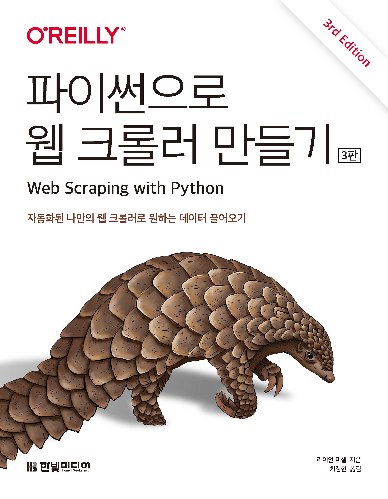

# 파이썬으로 웹 크롤러 만들기(3판)

『[파이썬으로 웹 크롤러 만들기(3판)]』(한빛미디어, 2025) 예제 코드 저장소입니다.  
이 저장소의 코드는 원서의 저자가 제공하는 코드 중 실행 오류가 발생하거나 오탈자가 있는 부분을 수정한 것입니다.  

원서의 저자가 제공하는 [코드](https://github.com/REMitchell/python-scraping)는 여기에서 확인할 수 있습니다.  

## 이 책에 대하여
오늘날 데이터가 넘쳐나는 웹에서 웹 크롤러로 할 수 있는 일은 무궁무진합니다. 이 마법을 위한 준비물은 약간의 파이썬 프로그래밍 능력 하나뿐, 나머지는 이 책에 모두 담겨 있습니다. 이 책을 활용하면 웹 크롤링을 이용해 업무를 자동화하고, 복잡한 웹 콘텐츠를 처리하는 통찰력을 얻게 될 것입니다. 새롭게 3판으로 개정된 이 책은 전반적인 코드를 최신화하고 실무에서 활용할 수 있는 예제를 추가했습니다. 또한 브라우저 자동화를 위한 셀레니움, 정확한 데이터 추출을 위한 XPath도 함께 다룹니다. 복잡한 웹 세상에서 효율적으로 데이터를 수집하고 싶은, ‘일상의 데이터 분석가’를 꿈꾸는 모두에게 이 책은 가장 정확한 나침반이 되어 줄 것입니다.

## 목차

PART 1 웹 스크레이퍼 제작  
CHAPTER 1 인터넷 작동 원리  
CHAPTER 2 웹 스크레이핑의 합법성과 윤리  
CHAPTER 3 웹 스크레이핑 활용 분야  
CHAPTER 4 첫 번째 웹 스크레이퍼  
CHAPTER 5 고급 HTML 분석  
CHAPTER 6 크롤링 시작하기  
CHAPTER 7 웹 크롤링 모델  
CHAPTER 8 스크레이피  
CHAPTER 9 데이터 저장  
 
PART 2 고급 스크레이핑  
CHAPTER 10 문서 읽기  
CHAPTER 11 지저분한 데이터 다루기  
CHAPTER 12 자연어 읽고 쓰기  
CHAPTER 13 폼과 로그인 뚫기  
CHAPTER 14 자바스크립트 스크레이핑  
CHAPTER 15 API를 통한 크롤링  
CHAPTER 16 이미지 처리와 텍스트 인식  
CHAPTER 17 스크레이핑 함정 피하기  
CHAPTER 18 스크레이퍼로 웹사이트 테스트하기  
CHAPTER 19 병렬 웹 스크레이핑  
CHAPTER 20 웹 스크레이핑 프록시  
